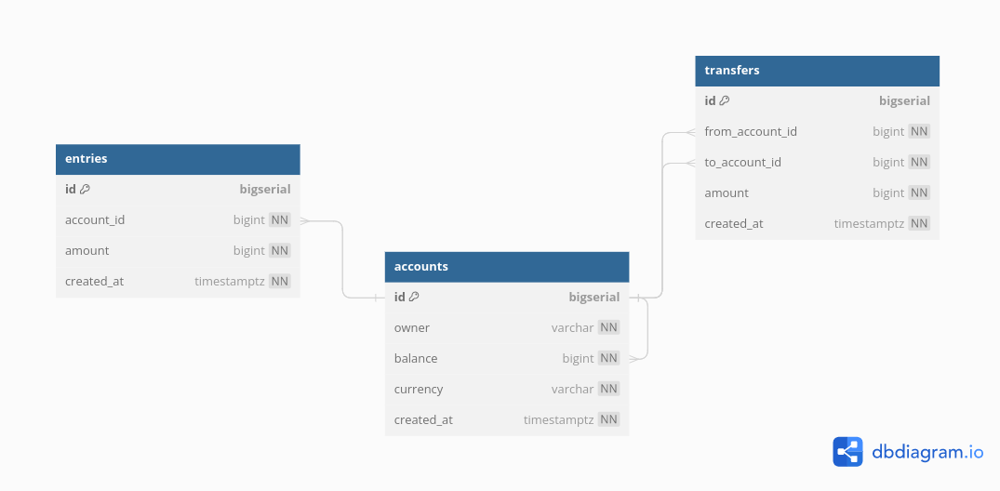

# Description
A SIMPLE BANK BACKEND
1. Create and manage account (owner, balance, currency)
2. Record all balance changes (create an account entry for each change)
3. Money transfer transaction (perform money transfer between 2 accounts consistently within a transaction)


# ERD



## Setup local development

### Install tools

- [Docker hub](https://hub.docker.com/)
- [Golang](https://golang.org/)
- [Migrate](https://github.com/golang-migrate/migrate/tree/master/cmd/migrate)
   
    ```bash
    curl -L https://packagecloud.io/golang-migrate/migrate/gpgkey | apt-key add -
    echo "deb https://packagecloud.io/golang-migrate/migrate/ubuntu/ $(lsb_release -sc) main" > /etc/apt/sources.list.d/migrate.list
    apt-get update
    apt-get install -y migrate
    ```

- [Sqlc](https://github.com/kyleconroy/sqlc#installation)
   
    ```bash
    sudo snap install sqlc
    ```
    
### Setup infrastructure
- Start postgres container:
    ```bash
    make postgres
    ```
- Create simple_bank database:
    ```bash
    make createdb
    ```
- Run db migration:
    ```bash
    make migrateup
    ```